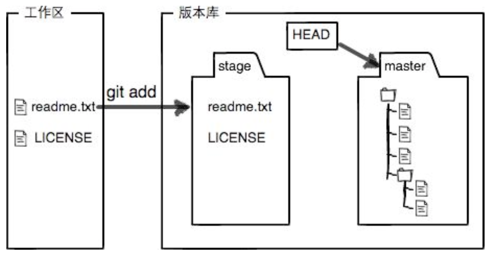
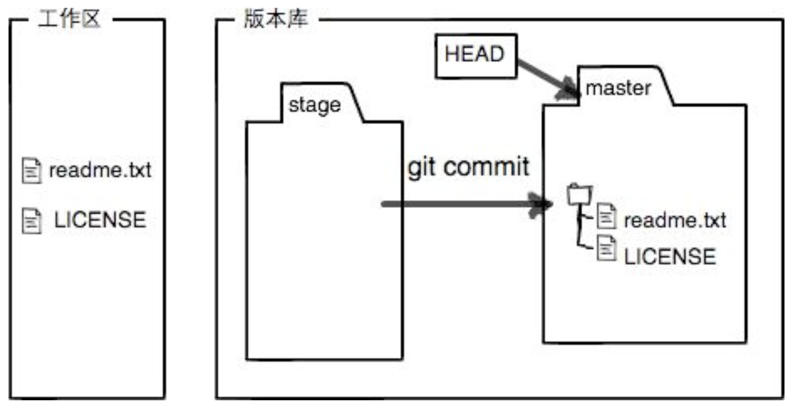
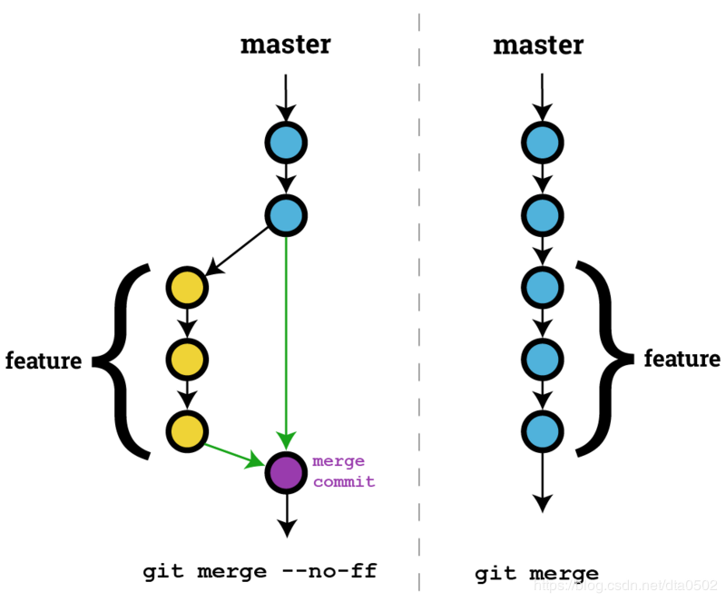

# Git 常用命令及基本概念

### 1. 创建版本库

* git init 
> 把当前所在目录变成 Git 可以管理的仓库（版本库）。Git 的版本库⾥里存了很多东西，其中最重要的就是称为 stage（或者叫index）的暂存区，还有 Git 为我们自动创建的第一个分⽀支 master，以及指向 master 的一个指针叫 HEAD 。

* git add fileName.xx
> 把文件添加到版本库。实际上就是把文件修改添加到版本库的暂存区。

* git commit -m "[description]"
> 把文件提交到版本库，-m 后面输入的是本次提交的说明。实际上就是把暂存区的所有内容提交到当前分⽀。

> 因为 commit 可以一次提交很多文件修改，所以你可以多次 add 不同的文件，⽐如:

```
$ git add file1.txt
$ git add file2.txt
$ git add file3.txt
$ git commit -m "add 3 files."
```

> 注意：
> 
> Mac每个目录都会有个文件叫 .DS_Store，它是用于存储当前文件夹的一些 Meta 信息。所以每次查看 Git 目录的状态，如果没有add这个 .DS_Store 文件，会有提示，像苍蝇一样特别烦。
> 
> 解决方案：
> 
> vi ~/.gitignore，输入 .DS_Store，换行再输入 */.DS_Store。这一步是忽略当前目录及其子目录的 .DS_Store。
> 
> vi ~/.gitignore_global，输入 .DS_Store，换行再输入 */.DS_Store。这一步是添加全局忽略文件。
> 
> vi ~/.gitconfig，输入 [core]，换行再输入 excludesfile = ~/.gitignore_global。这一步是在配置中引入全局忽略文件。

### 2. 时光穿梭机

* git status
> 可以让我们时刻掌握版本库当前的状态。比如，告诉我们 fileName.xx 被修改过了，但还没有提交修改。

* git diff fileName.xx
> 顾名思义就是查看 difference，可以用来查看文件具体修改了什么内容。

### 3. 版本回退

* git log
> 显示从最近到最远的提交⽇志。穿梭前，⽤此命令可以查看提交历史，以便确定要回退到哪个版本。

* git reset --hard HEAD^ ｜ git reset --hard [commit id]
> 回退至上一个版本。在 Git 中，用 HEAD 表示当前版本，也就是最新的提交，上一个版本就是 HEAD^ ，上上一个版本就是 HEAD^^ ，当然往上100个版本写100个 ^ 比较容易数不过来， 所以写成HEAD~100。

* git reflog
> 记录你的每一次命令。可用于查看 [commit id] ，并与上条命令配合使用，可用来在各个版本之间切换。穿梭后，用此命令查看命令历史，以便确定要回到未来的哪个版本。

### 4. 工作区和暂存区

* 执行 git add fileName.xx，会将工作区文件添加到版本库的暂存区。
> 

* 执行 git commit，会一次性将暂存区的所有修改提交到版本库的分⽀。
> 

### 5. 管理修改

> Git是如何跟踪修改的？每次修改，如果不 add 到暂存区，那后续 commit 时就不会将修改提交至版本库的分支中。

* git diff HEAD -- fileName.xx
> 查看工作区和版本库里面最新版本的区别。

### 6. 撤销修改

* git checkout -- fileName.xx
> 把文件在工作区的修改全部撤销，这里有两种情况：一种是 fileName.xx 自修改后还没有被放到暂存区，现在，撤销修改就回到和版本库一模⼀样的状态；一种是 fileName.xx 已经添加到暂存区后，又作了修改，现在，撤销修改就回到添加到暂存区后的状态。总之，就是让这个文件回到最近一次 git add 或 git commit 时的状态。

* git reset HEAD fileName.xx
> 把暂存区的修改撤销掉(unstage)，重新放回工作区。此时⽤用 git status 查看一下，提示现在暂存区是干净的，工作区有修改。还记得如何丢弃工作区的修改吗？git checkout -- fileName.xx 。

> 已经提交了不合适的修改到版本库时，想要撤销本次提交，参考版本回退一节，不过前提是没有推送到远程库。

### 7. 删除文件

* git rm fileName.xx

* git commit -m "description"

> 从版本库中删除该文件，用命令 git rm 删掉，并且 commit 。

> 工作区中的文件被误删，用 git checkout -- fileName.xx 可将版本库里的版本恢复到工作区中，无论工作区是修改还是删除，都可以“一键还原”。

### 8. 添加远程库

* git remote add origin git@github.com:hezhang18/learngit.git
> 把一个已有的本地仓库与远程仓库关联。

* git push -u origin master
> 把本地库的内容推送到远程，⽤ git push 命令，实际上是把当前分支 master 推送到远程。

> 由于远程库是空的，第一次推送 master 分⽀时，加上了 -u 参数，这样 Git 不但会把本地的 master 分支内容推送到远程新的master 分支，还会把本地的 master 分支和远程的 master 分支关联起来，在以后的推送或者拉取时就可以简化命令。

> 添加后，远程库的名字就是 origin，这是 Git 默认的叫法，也可以改成别的，但是 origin 这个名字一看就知道是远程库。

> 注意：
> 
> 一般由于先有本地仓库，然后创建远程仓库并用 git remote add 命令进行关联。此时，远程仓库存在 README.md，LICENSE，.gitignore文件，而本地仓库不存在，此时使用 git push 提交命令则会报错，错误内容如下所示：
>> 提示：更新被拒绝，因为远程仓库包含您本地尚不存在的提交。
>> 
>> 提示：一个仓库已向该引用进行了推送。再次推送前，您可能需要先整合远程变更。
>> 
> 解决方案：
> 
>> 使用命令：git pull origin master --allow-unrelated-histories
>> 
>> 这样对本地仓库和远程仓库进行合并冲突后，就可以正常使用 git push命令了。
>> 

* git push origin master
> 把本地 master 分支的最新修改推送至 GitHub（只在第一次推送时加 -u 参数）。

* git remote
> 查看远程库的信息。

* git remote -v
> 查看远程库更详细的信息。

* git remote rm origin
> 删除远程库。

### 9. 从远程库克隆

* git clone git@github.com:hezhang18/learngit.git
> 从远程库克隆至本地。

### 10. 分支管理

* git checkout -b [branch name]
> git checkout 命令加上 -b 参数表示创建并切换，相当于以下两条命令:
>> git branch dev，创建 dev 分支。
>> 
>> git checkout dev，切换至 dev 分支。

* git branch 
> 查看当前分⽀。

* git merge [branch name]
> 合并指定分支到当前分⽀。

* git branch -d [branch name]
> 删除 dev 分⽀。

### 11. 解决冲突

> 当 Git 无法自动合并分支时，就必须首先解决冲突。解决冲突后，再提交，合并完成。用 git log --graph 命令可以看到分支合并图。

* git log --graph
> 查看分支合并图。

* git log --graph --pretty=oneline
> 简化日志信息，将每个提交放在一行显示，查看的提交数很大时非常有用。

* git log --graph --pretty=oneline --abbrev-commit
> 简化头部信息（commit id）。

### 12. 分支管理策略

* git merge --no-ff -m "[description]" [branch name]
> 因为这种合并方式要创建一个新的 commit，所以加上 -m 参数，把 commit 描述写进去。

> 通常，合并分支时，如果可能，Git会用“Fast forward”模式，但这种模式下，删除分支后，会丢掉分支信息。如果要强制禁用“Fast forward”模式，Git 就会在 merge 时⽣成⼀个新的 commit，这样，从分支历史上就可以看出分⽀信息。
> 
> 

> 分支管理策略：在实际开发中，首先，master 分支应该是非常稳定的，也就是仅⽤来发布新版本，平时不能在上面干活；干活都在 dev 分支上，也就是说，dev分支是不稳定的，到某个时候，比如 1.0 版本发布时，再把 dev 分支合并到 master 上进行版本发布；平时工作时每个人都在 dev 分支上干活，每个人都有自己的分支，时不时地往 dev 分支上合并就可以了。

### 13. Bug分支

> 当你接到一个修复 bug 的任务时，很自然地，你想创建一个分支来 修复它，但是，当前正在 dev 上进行的工作只进⾏到⼀半还没法提交，预计完成还需1天时间。而该 bug 必须在两个小时内修复。这时就会用到 Git 提供的 stash 功能，可以把当前工作现场“储藏”起来，等以后恢复现场后继续工作。

* git stash
> 把当前工作现场（stash）保存起来，此时用 git status 查看工作区，就是干净的，可以放心地创建分支来修复 bug。

* git stash list
> 查看被保存的工作现场（stash）的列表。

* git stash apply
> 恢复 stash，但是恢复后，stash 内容并不删除。此时 git stash list 仍可查看 stash 内容。

* git stash apply stash@{0}
> 恢复指定 stash。

* git stash drop
> 删除 stash 的内容。

* git stash pop
> 恢复工作现场（stash）的同时删除 stash 内容。此时 git stash list 不可查看 stash 内容。

### 14. feature 分支

> 每添加⼀个新功能，最好新建一个 feature 分支，在上面开发，完成后，合并，最后，删除该 feature 分支。

* git branch -D [branch name]
> 强行删一个没有被合并过的分支。

### 15. 多人协作

* git push origin [branch name]
> 从本地推送分支，如果推送失败，先用 git pull 抓取远程的新提交，如果有冲突，要先处理冲突。

* git checkout -b [branch name] origin/[branch name]
> 在本地创建和远程分支对应的分支，本地和远程分支的名称最好一致。

* git branch --set-upstream [branch name] origin/[branch name]
> 建立本地分支和远程分支的关联。

### 16. 标签管理

> 发布一个版本时，我们通常先在版本库中打⼀个标签，这样，就唯⼀确定了打标签时刻的版本。将来⽆论什么时候，取某个标签的版本，就是把那个打标签时刻的历史版本取出来。创建标签前，首先切换到需要打标签的分支上:

* git tag
> 查看所有标签。

* git tag [tag name]
>打一个新标签，默认标签打在最新提交的 commit 上。如，git tag v1.0。

* git tag [tag name] [commit id]
> 为某一个历史提交的 commit id 打标签。

* git tag -a [tag name] -m "descriptive text" [commit id]
> -a 指定标签名，-m 指定说明⽂字。

* git show [tag name]
> 查看某个标签的说明文字。

* git tag -s [tag name] -m "descriptive text" [commit id]
> -s 私钥签名一个标签，签名采用 PGP 签名，用PGP签名的标签是不可伪造的，因为可以验证 PGP 签名。使用前必须安装 gpg(GnuPG)。

* git tag -d [tag name]
> 删除标签。

* git push origin [tag name]
> 推送某个标签到远程。

* git push origin --tags
> 一次性推送全部尚未推送到远程的本地标签。

> 删除远程标签：
> 1. git tag -d [tag name] 先删除一个本地标签;
> 2. git push origin :refs/tags/[tag name] 再删除一个远程标签。


***
### 备忘

##### 1. 常用 LINUX 命令

> * mkdir fileFolder
> * cd fileFolder
> * touch fileName.xx
> * vi fileName.xx; i; esc -> :wq;
> * cat fileName.xx
> * rm -rf fileFolder
> * rm fileName.xx

##### 2. 学习过程遇到的问题

> 推送到远程仓库时总是默认使用遗弃账户 hezhang94。搜索解决方案，可以通过在全局重新设置账户名称和邮箱进行解决，但是依然没有效果（账号都显示为重新设置后的新账户），但 push 时仍使用旧账户进行推送，导致失败；继续尝试清除账号的缓存，重新安装 GitHub 并登录，依然无法解决；最后发现是 https 和 ssh 之间的问题，应使用后者进行推送（git remote add origin git@github.com:hezhang18/learngit.git；git push -u origin master）。